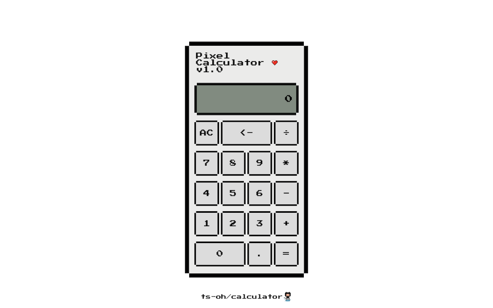

# Calculator

Live demo <https://ts-oh.github.io/calculator/>

## Screenshots

## This is a calculator project from 'The Odin Project'

- Used: JavaScript, CSS, and HTML.

- Features:

  - [x] Users can get floating point numbers if they do the math required to get one, but they can’t type them in yet. Add a . button and let users input decimals! Make sure you don’t let them type more than one though: 12.3.56.5. It is hard to do math on these numbers. (disable the decimal button if there’s already one in the display).

  - [x] Calculations can be chained.

  - [x] Add a “backspace” button, so the user can undo if they click the wrong number.

  - [x] Add keyboard support.

  - [x] Make it look nice!

### Lessons/Comments

This was my first time building a calculator using 🍦JS. My first attempt was using an array in the logic to store numbers and operators. However, my approach was too complex weaving through various array methods. Later on I found a simpler logic of using variables to store inputs. 

Overall, it was good experience learning about DOM manipulation, conditionals, building functions to pass arguements and recieve parameters. 
 
